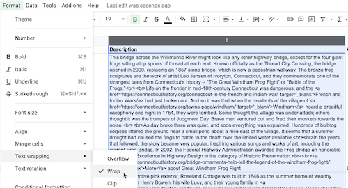

# cth-storymaps-practice
Try it out

## Live links
- Leaflet Map https://jackdougherty.github.io/cth-storymaps-practice/
- Linked Google Sheets template https://docs.google.com/spreadsheets/d/1CsIRBZGWMIm_iYPsNS5FwOLTOlH6zasw8WbCFKGCQLk/edit#gid=0

## How to Add and Edit Map Data and Settings

Here's a quick summary, and you can read more details in *Hands-On Data Visualization* https://HandsOnDataViz.org/leaflet-storymaps-with-google-sheets.html

For this practice map, all of the map data is stored in two locations:

- open the linked Google Sheet to edit text and map data, add new chapters, or modify map settings
- upload new JPG and PNG images to the `media` folder in GitHub

## About entering data into the linked Google Sheet

- Notice different tabs: Chapters, Options, Geocoding details
- Each spreadsheet row equals one storymap chapter, and can contain only one media element (such as a JPG or PNG image, audio file, video link, etc).

The *Description* field can hold multiple paragraphs for each chapter, but the text must be consistent with HTML coding. This means:

- Use *straight* single-quotes (also known as apostrophes) and double-quotes (`"`), *not* curly quotes that are commonly created by word-processor tools.
- To create a new paragraph, insert a double line-break (`<br><br>`)
- To enter links, use HTML tags to open in a new browser tab, such as:

```
.<br><br><a href='https://connecticuthistory.org/bridge-ornaments-help-tell-the-legend-of-the-windham-frog-fight/' target='_blank'>More</a> about Windham's Frog Fight
```

When working with large amounts of *Description* text, you may find it easiest to first use a text editor tool such as [Atom Editor](https://atom.io), create a file named `temporary.html`, set *View > Toggle Soft Wrap*, and paste and prepare your *Description* text there before copying and pasting back into the Google Sheet.

Also, install the [Dumb-Quoter Atom Package](https://atom.io/packages/dumb-quoter) to convert curly-quotes into straight-quotes with CTRL-ALT-' (or CTRL-OPTION-' on Mac).

In Google Sheets, use *Format > Text wrapping > Wrap* to view the entire cell as needed, then go back to *Overflow* when done.  



#### Geocode your address data with Google Sheets add-on
To geocode (find latitude and longitude coordinates), we recommend installing the free [Geocoding by SmartMonkey add-on for Google Sheets](https://gsuite.google.com/marketplace/app/geocoding_by_smartmonkey/1033231575312). Insert your addresses in place of the samples in the Geocoding Details tab, then use Add-Ons > Geocoding > Geocode Details menu. Learn more in *Hands-On Data Visualization* https://handsondataviz.org/geocode.html


## To upload media to GitHub

- organize your JPG or PNG files to match your location names (such as frog-bridge.jpg, frog-bridge2.jpg, etc.)
- highly recommended: use all lowercase file names (including .jpg, *NOT* .JPG)
- log into GitHub account, click on the media folder, and upload files as needed 
